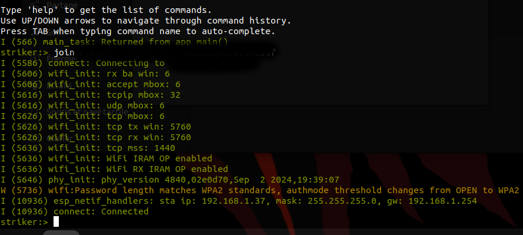
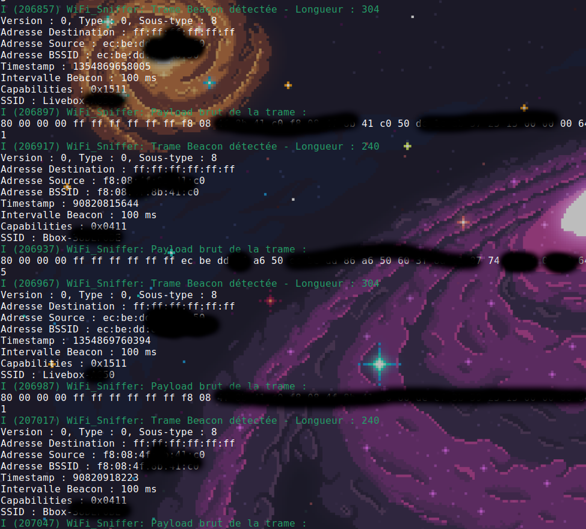
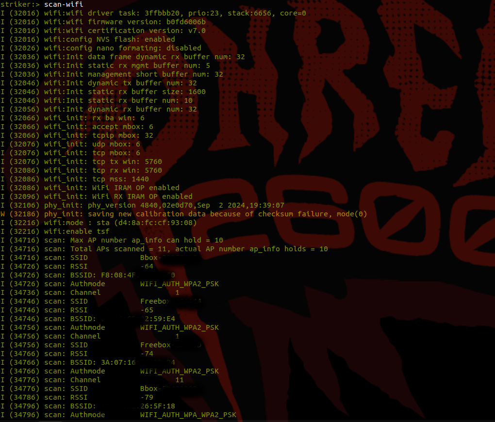
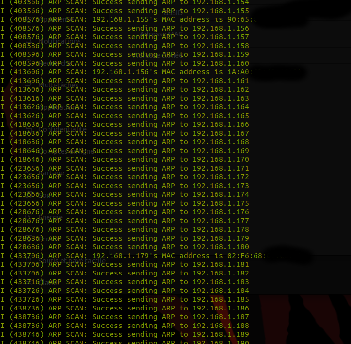
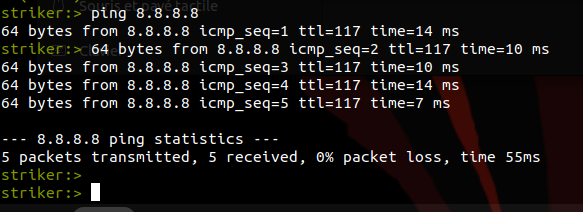

| Supported Targets | ESP32 |
-----------------------------

## Overview

ESPILON is a shell interface for ESP32 that supports various commands for system management, Wi-Fi operations, and debugging. This project provides a prebuilt binary and a guide for building the firmware from source using ESP-IDF.

## Compilation 

The code has already been built (for an ESP32 DevKit), and you can simply flash the binary using the following commands:
```
# Method 1
idf.py flash

# Méthod 2
pip install esptool
esptool.py --chip esp32 --port /dev/ttyUSB0 --baud 460800 write_flash -z 0x1000 build/espilon.bin
```
If you want to recompile it yourself while modifying hardcoded paths in main/idf_component.yml, connect your ESP32 and run the following commands:
```
idf.py fullclean
idf.py build 
idf.py flash && idf.py monitor
```
Check the paths in *idfconfig* within the main folder and update them accordingly:

```
idf.py menuconfig
Enable UART
CONFIG_ESP_CONSOLE_UART_DEFAULT
```

## Command
Helper

```
striker:> help
free 
  Get the current size of free heap memory

heap 
  Get minimum size of free heap memory that was available during program
  execution

version 
  Get version of chip and SDK

restart 
  Software reset of the chip

tasks 
  Get information about running tasks

log_level  <tag|*> <none|error|warn|debug|verbose>
  Set log level for all tags or a specific tag.
       <tag|*>  Log tag to set the level for, or * to set for all tags
  <none|error|warn|debug|verbose>  Log level to set. Abbreviated words are accepted.

light_sleep  [-t <t>] [--io=<n>]... [--io_level=<0|1>]...
  Enter light sleep mode. Two wakeup modes are supported: timer and GPIO.
  Multiple GPIO pins can be specified using pairs of 'io' and 'io_level'
  arguments. Will also wake up on UART input.
  -t, --time=<t>  Wake up time, ms
      --io=<n>  If specified, wakeup using GPIO with given number
  --io_level=<0|1>  GPIO level to trigger wakeup

deep_sleep  [-t <t>] [--io=<n>] [--io_level=<0|1>]
  Enter deep sleep mode. Two wakeup modes are supported: timer and GPIO. If no
  wakeup option is specified, will sleep indefinitely.
  -t, --time=<t>  Wake up time, ms
      --io=<n>  If specified, wakeup using GPIO with given number
  --io_level=<0|1>  GPIO level to trigger wakeup

join  [--timeout=<t>] <ssid> [<pass>]
  Join WiFi AP as a station
  --timeout=<t>  Connection timeout, ms
        <ssid>  SSID of AP
        <pass>  PSK of AP

sniffer 
  Démarre le mode promiscuous et affiche les trames Wi-Fi

scan-wifi 
  scan all network around us

ping  [-W <t>] [-i <t>] [-s <n>] [-c <n>] [-Q <n>] [-T <n>] [-I <n>] <host>
  send ICMP ECHO_REQUEST to network hosts
  -W, --timeout=<t>  Time to wait for a response, in seconds
  -i, --interval=<t>  Wait interval seconds between sending each packet
  -s, --size=<n>  Specify the number of data bytes to be sent
  -c, --count=<n>  Stop after sending count packets
  -Q, --tos=<n>  Set Type of Service related bits in IP datagrams
  -T, --ttl=<n>  Set Time to Live related bits in IP datagrams
  -I, --interface=<n>  Set Interface number
        <host>  Host address

scan-arp 
  Please Be connect to start this command

nvs_set  <key> <type> -v <value>
  Set key-value pair in selected namespace.
  Examples:
  nvs_set VarName i32 -v 123 
  nvs_set VarName str -v YourString 
  nvs_set VarName blob -v 0123456789abcdef 
         <key>  key of the value to be set
        <type>  type can be: i8, u8, i16, u16 i32, u32 i64, u64, str, blob
  -v, --value=<value>  value to be stored

nvs_get  <key> <type>
  Get key-value pair from selected namespace. 
Example: nvs_get VarName i32
         <key>  key of the value to be read
        <type>  type can be: i8, u8, i16, u16 i32, u32 i64, u64, str, blob

nvs_erase  <key>
  Erase key-value pair from current namespace
         <key>  key of the value to be erased

nvs_namespace  <namespace>
  Set current namespace
   <namespace>  namespace of the partition to be selected

nvs_list  <partition> [-n <namespace>] [-t <type>]
  List stored key-value pairs stored in NVS.Namespace and type can be specified
  to print only those key-value pairs.
  Following command list variables stored inside 'nvs' partition, under
  namespace 'storage' with type uint32_tExample: nvs_list nvs -n storage -t u32
  
   <partition>  partition name
  -n, --namespace=<namespace>  namespace name
  -t, --type=<type>  type can be: i8, u8, i16, u16 i32, u32 i64, u64, str, blob

nvs_erase_namespace  <namespace>
  Erases specified namespace
   <namespace>  namespace to be erased

help  [<string>]
  Print the summary of all registered commands if no arguments are given,
  otherwise print summary of given command.
      <string>  Name of command

```

### Connect 
In this image, the join command is used as follows:
`join <ssid> <pass>`
The connection initializes with the event *esp_netif_handlers*, assigning a DHCP lease in the network.


### WiFi-scanner & Sniffer 

The ESP32 sniffs Wi-Fi frames effectively!



In this image, the network scan displays the following information:
`<SSID BSSID RSSI AUTHMODE CHANNEL>` 



### ARP scan

The ARP scan returns devices on my LAN 192.168.1.0/24.


### Ping
Ping command
```ping  [-W <t>] [-i <t>] [-s <n>] [-c <n>] [-Q <n>] [-T <n>] [-I <n>] <host>```



## Author
- Eun0us
